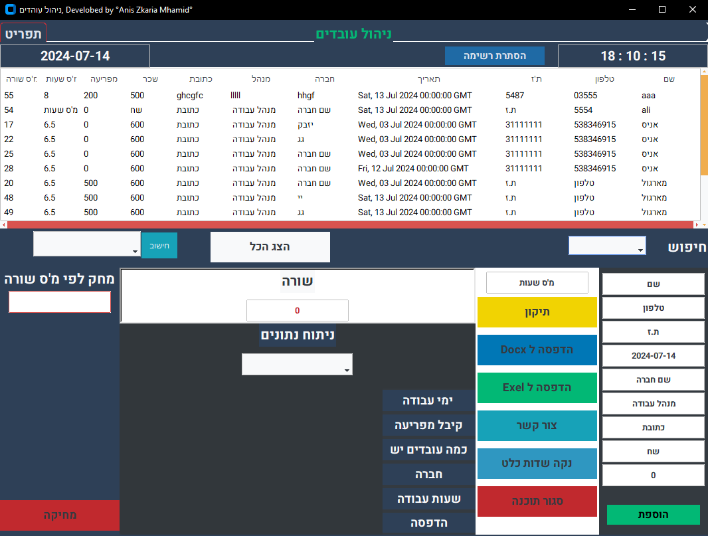

# application image

# Description

This project is a Workers Manager System (WMS) developed to efficiently manage employee data, track salary payments, and facilitate searching and updating records. It consists of multiple windows, each serving different functionalities to streamline the management process effectively.

## Table of Contents

- [Introduction](#introduction)
- [Features](#features)
- [File Structure](#file-structure)
- [Publishing](#publishing)
- [Dependencies](#dependencies)
- [Contact Information](#contact-information)
- [Author](#author)

## Application features

- *Manage workers easily and effectively*

Users can fully manage employee data through an easy-to-use interface that supports several core functions

Add, view, update, and delete records: Users can fully manage employee records, including adding new data, viewing existing details, updating information, and deleting records when needed.

Accurate tracking of payroll data: Users are able to record employee payroll deductions on a regular basis, including details such as employee name, ID number, date period, and payment date.

- *Use modern technologies and a secure database*

Using MySQL and SQLAlchemy: Employee data is stored and managed using a MySQL database, with SQLAlchemy being used to facilitate communication with the database and ensure data integrity and ease of querying.

- *API support for interacting with data*

RESTful API: The application provides API endpoints for interacting with employee data, enabling simple and secure access, updating, and deletion of data over HTTP.
Provide flexibility and integration
Flexibility in installation and deployment: The application can be deployed on multiple platforms like Windows, macOS, and Linux by compiling it into executable files using tools like PyInstaller or cx_Freeze, which facilitates the usage and deployment process for different users.
Modern technology to improve performance
Using Flask and Python: The application is built using Flask, a lightweight and flexible Python framework, providing highly efficient performance and easy development and maintenance.

## File Structure

- **main_Screen.py**: Main Python file containing the application's logic.
- **API.py**: Handles database operations.

## Publishing

The application can be published on various platforms such as Windows, macOS, and Linux by packaging it into executable files using tools like PyInstaller or cx_Freeze.

## Dependencies

- Python 3.x
- Tkinter
- customtkinter
- ttkbootstrap
- webbrowser
- requests
- pymysql
- logging
- flask
- flask_sqlalchemy
- sqlalchemy
- datetime
- openpyxl
- docx
- pptx
- reportlab

## Contact Information

For inquiries or support, please contact Anis Mahamid at anesmhamed1@gamil.com

## Author

Developed by Anis Mahamid.
